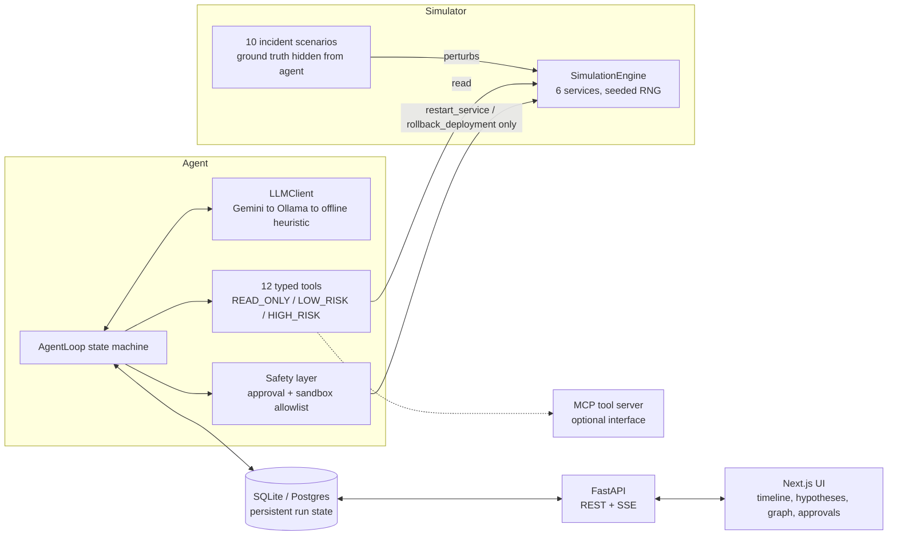

# AIRE — Autonomous Incident Response Engineer

AIRE is an agent that gets paged, investigates a production incident on a
simulated microservice fleet, forms and tests hypotheses against real
telemetry, proposes a remediation, gets human sign-off when the action is
risky, executes it in a sandbox, verifies the fix, and either resolves the
incident or rolls back and keeps investigating.

It is built to be inspected, not just run: every observation, hypothesis,
tool call, action, and verification is persisted, timestamped, and
rendered in a UI as it happens — decisions, evidence, actions, and results,
never raw model chain-of-thought.

```
python scripts/inject_incident.py --type bad_deployment --investigate --approve-all
```

resolves a real incident end-to-end in your terminal in about 5 iterations,
with no API key, no Docker, and no network access required.

## Why this exists

Most "AI incident response" demos are a chatbot with a system prompt about
SRE. This is not that. AIRE is a closed-loop control system with:

- a **deterministic, reproducible simulator** (not a chat transcript) that
  generates real logs/metrics/traces/deploys/config/git history for six
  services, and 10 scripted, reproducible fault injections;
- an explicit **state machine** for the investigation loop, with
  persistent state, iteration/time/token budgets, duplicate-action
  detection, and loop detection — not "call the model in a while loop until
  it stops";
- **typed tools behind a common interface**, risk-classified
  (`READ_ONLY`/`LOW_RISK`/`HIGH_RISK`), where only two tools can mutate
  anything and both go through a hard-allowlisted sandbox executor — no
  tool ever gets shell access;
- a **human approval gate** for high-risk actions that actually blocks
  execution until a decision is recorded, resumable from a separate
  process (the API/UI) after a CLI run paused;
- an **LLM provider chain** (Gemini → Ollama → a deterministic offline
  heuristic) so the exact same loop runs identically in CI, in a demo with
  no API key, or against a real hosted model;
- an **evaluation harness** that runs every scenario multiple times and
  scores root-cause accuracy, remediation success, escalation rate,
  unnecessary actions, and cost — not vibes.

## Quickstart

```bash
# CLI-only, zero setup beyond Python 3.12 (creates the venv on first run):
scripts/demo.sh                      # bad_deployment — shows the approval gate
scripts/demo.sh redis_failure        # any of 10 scenarios
scripts/demo.sh --list               # list scenario types

# Full stack, for the observability UI:
cd backend && python -m venv .venv && .venv/bin/pip install -r requirements.txt
.venv/bin/uvicorn app.main:app --reload &
cd frontend && npm install && npm run dev
# open http://localhost:3000, inject an incident, click "Start investigation"
```

See [docs/DEMO.md](docs/DEMO.md) for a 3-minute walkthrough script.

## Architecture



Full component/data-flow detail: [docs/ARCHITECTURE.md](docs/ARCHITECTURE.md).

## Documentation

| Doc | Contents |
| --- | --- |
| [docs/ARCHITECTURE.md](docs/ARCHITECTURE.md) | Components, data flow, persistence model |
| [docs/AGENT_LOOP.md](docs/AGENT_LOOP.md) | The state machine, budgets, stopping conditions, loop/dedup detection |
| [docs/TOOLS.md](docs/TOOLS.md) | All 12 tools, typed schemas, risk levels |
| [docs/SAFETY.md](docs/SAFETY.md) | Risk classification, approval flow, sandbox allowlist |
| [docs/INCIDENT_SCENARIOS.md](docs/INCIDENT_SCENARIOS.md) | The 10 scenarios, ground truth, correct fix |
| [docs/EVALUATION.md](docs/EVALUATION.md) | Benchmark metrics, how to run it, baseline results |
| [docs/DEMO.md](docs/DEMO.md) | 3-minute recruiter demo script |
| [docs/RESUME.md](docs/RESUME.md) | Resume-ready bullet points for this project |
| [PLAN.md](PLAN.md) / [TODO.md](TODO.md) | Build plan and progress tracking |

## Repository layout

```
backend/app/
  simulator/    world model, telemetry generators, scenarios, engine
  tools/        typed tool interface + 12 implementations
  llm/          provider protocol, Gemini/Ollama/offline providers, fallback client
  agent/        the state machine, stopping conditions, hypothesis/factory
  safety/       risk policy, approval lifecycle, sandbox executor
  api/          FastAPI routers (incidents, tools), SSE stream, execution graph
  mcp_server/   MCP-compatible tool server (stdio)
  eval/         benchmark runner
  models_db.py  persistent state schema (SQLAlchemy)
frontend/       Next.js observability UI
scripts/        inject_incident.py, run_agent.py, run_eval.py, demo.sh
eval/results/   benchmark output (baseline_offline_provider.json committed)
docker-compose.yml, backend/Dockerfile, frontend/Dockerfile
.github/workflows/ci.yml
```

## Stack

Python 3.12 · FastAPI · SQLAlchemy (SQLite locally, Postgres via
docker-compose) · Next.js (App Router, TypeScript) · Gemini API (primary
LLM) · Ollama (local fallback) · a deterministic offline heuristic
(hermetic fallback, default for tests/CI) · MCP · Docker Compose.

## Environment notes (read before assuming Docker/Ollama work)

This was built and verified on a machine with **no Docker and no Ollama
installed**. Everything runs natively: SQLite by default, and the LLM
client falls back to the offline provider automatically. `docker-compose.yml`
and the two Dockerfiles are written correctly against Postgres/Node images
but have **not been run** — see [PLAN.md](PLAN.md) for the full list of
what was and wasn't verified, and how.

## Tests

```bash
cd backend && .venv/bin/pytest -q      # 19 tests: full loop, safety, MCP server
python scripts/run_eval.py --trials 3  # benchmark: 30/30 runs resolve correctly
```
