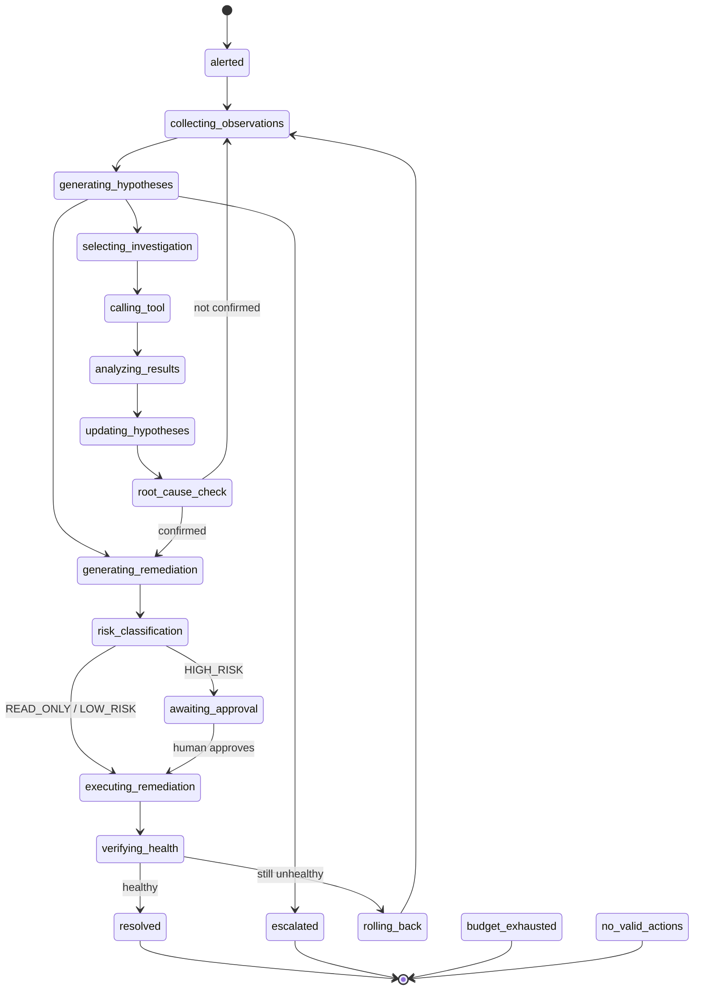

# The Agent Loop

`backend/app/agent/loop.py:AgentLoop` implements this exact state machine.
The diagram below is transcribed directly from `backend/app/api/graph.py`
(`NODES`/`EDGES`) — the same data the UI's execution-graph view renders —
so this doc can't drift from the code without the UI drifting too.

One thing the diagram can't show: **one LLM call covers several of these
nodes at once**. `generating_hypotheses` → `selecting_investigation` →
... → `root_cause_check` (or straight to `generating_remediation`) is a
single structured decision from `LLMClient.decide()`
(`backend/app/llm/base.py:LLMStepDecision`) — the code still logs each
phase transition as its own `IncidentEvent`, but it doesn't make a
separate model/API call per phase. This is deliberate: token/API-call
budget is a first-class constraint (see below), and collapsing
hypothesis-generation/investigation-selection/root-cause-check into one
ReAct-style call per iteration is what keeps a 5-iteration investigation
at ~3,500 tokens instead of 5x that.

## Persistent state

Every iteration writes rows, not memory. `AgentLoop` never accumulates
investigation history in Python state across calls — `_build_context()`
re-reads `ToolCallLog`/`Hypothesis` from the DB every time
(`backend/app/agent/loop.py:_build_context`). What's actually persisted
per incident run:

| Table | What it holds |
| --- | --- |
| `Incident` | phase, iteration/tool-call/token counters, budgets, confirmed root cause |
| `IncidentEvent` | the UI timeline — `kind` ∈ {decision, evidence, action, result} |
| `Hypothesis` | description, target service, confidence, status (active/confirmed/rejected) |
| `ToolCallLog` | every investigation tool call, its args, result, and a dedup hash |
| `ActionLog` | every proposed remediation, its risk level, approval status, execution result |
| `VerificationResult` | post-remediation health check, tied to the `ActionLog` row |
| `IncidentNote` | free-text notes from `create_incident_note` |

## Budgets

Configured per incident (`Incident.max_iterations/max_seconds/max_tokens`,
defaulting from `Settings`), checked before every iteration in
`agent/stopping.py:check_budgets`:

- **max_iterations** (default 15) — one `AgentLoop.step()` call = one iteration.
- **max_seconds** (default 120) — wall clock since `Incident.created_at`.
- **max_tokens** (default 60,000) — cumulative `TokenUsage.total` from every
  `LLMClient.decide()` call, including the offline provider's estimate.

Hitting any of them sets `stopping_reason = BUDGET_EXHAUSTED` and ends the run.

## Duplicate-action and loop detection

`AgentLoop` computes a `dedup_hash(tool_name, args)`
(SHA-256 of the tool name + sorted args, `agent/stopping.py:dedup_hash`)
for every investigation tool call and keeps the set of hashes already
executed for this incident — reconstructed from `ToolCallLog` at
`AgentLoop.__init__`, not just held in memory, so it survives a resumed run.

If the model proposes a tool call whose hash is already known:
1. the tool is **not** called again (no wasted budget, no duplicate DB row);
2. an `IncidentEvent` records the duplicate was detected and reused;
3. a `consecutive_stalls` counter increments.

Two consecutive duplicate proposals with no new evidence in between →
`StoppingReason.LOOP_DETECTED`, phase → `escalated`. This is what stops a
model that keeps re-asking the same question from burning its whole
iteration budget doing nothing (`test_agent_loop_e2e.py` exercises the
resolution paths; loop detection is exercised by construction — the
offline provider's own investigate→confirm ladder never repeats a call, so
this path only fires against a real LLM that stalls, which is exactly the
scenario it exists for).

## Machine-verifiable stopping conditions

| `StoppingReason` | Fires when |
| --- | --- |
| `INCIDENT_RESOLVED` | post-remediation health check reports healthy |
| `BUDGET_EXHAUSTED` | iteration/time/token budget hit (checked, not inferred) |
| `HUMAN_ESCALATION_REQUIRED` | model returns `next_action.kind == "escalate"`, or every LLM provider failed, or both restart and rollback were tried without recovery |
| `LOOP_DETECTED` | two consecutive duplicate proposals (see above) |
| `NO_VALID_ACTIONS_REMAINING` | proposed tool isn't a valid remediation tool, args fail validation, or the sandbox rejects it |

`AWAITING_APPROVAL` is deliberately **not** in this table — pausing for a
human decision is not a terminal state. `AgentLoop.run_to_completion()`
returns `None` in that case, and `AgentLoop.resume_after_approval()`
continues the same run once a decision is recorded
(`safety/approval.py:decide`). See [SAFETY.md](SAFETY.md).

## Recovered? No → rollback + continue

When an executed remediation doesn't restore health
(`AgentLoop._execute_approved_action`), the loop doesn't just retry the
same action — it:

1. records the failed `VerificationResult` against that `ActionLog`;
2. sets `incident.phase = collecting_observations` and returns to the
   investigation loop with `last_verification_failed=True` in the next
   `AgentContext`;
3. the offline provider's `_retry_after_failed_verification` (and the
   equivalent instruction to a real LLM in `llm/prompts.py`) then proposes
   the *other* remediation class it hasn't tried yet (restart ↔ rollback)
   before escalating.

This is exercised directly in `test_agent_loop_e2e.py::test_rejected_approval_continues_investigation_then_can_be_reapproved`.
