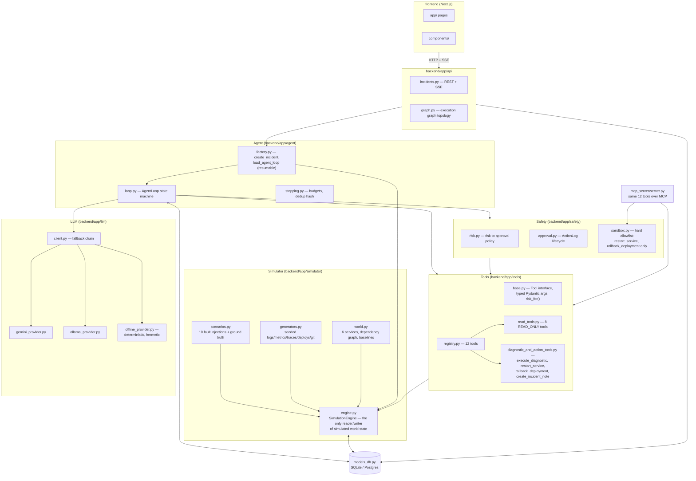

# Architecture

## Components



## Why an isolated simulated world per incident

Every table that holds telemetry (`log_entries`, `metric_points`,
`trace_spans`, `deployments`, `git_commits`, `config_snapshots`,
`service_states`) is keyed by `incident_id`. There is no shared "the
fleet" singleton. This means:

- two incidents never interfere with each other, so scenarios are safe to
  run concurrently (the eval harness runs 30 of them back to back);
- a run is fully reproducible from `(scenario_type, seed)` — `SimulationEngine.bootstrap()`
  and `scenario.apply()` are pure functions of a seeded `random.Random`;
- resuming a run (e.g. after a HIGH_RISK approval, from a different
  process) just needs `(session, incident_id)` — `SimulationEngine` holds
  no other state (see `agent/factory.py:load_agent_loop`).

## Persistence is the state machine's memory, not a log

`backend/app/models_db.py` defines the tables the spec calls "persistent
state": `Incident`, `Observation` (superseded by `ToolCallLog`, see note
below), `Hypothesis`, `ToolCallLog`, `ActionLog`, `VerificationResult`,
`IncidentNote`, and `IncidentEvent` (the UI-facing timeline). `AgentLoop`
never keeps investigation history in memory across calls — `_build_context()`
re-queries the DB every iteration, and `_load_known_hashes()` reconstructs
duplicate-call detection from `ToolCallLog` rows at construction time. This
is what makes a run resumable across process boundaries: the CLI can start
an investigation, pause on a HIGH_RISK approval, and the API (a different
process, a different `AgentLoop` instance) can approve and resume it — see
`test_agent_loop_e2e.py::test_high_risk_action_blocks_without_approval` and
`AgentLoop.resume_after_approval`.

(`Observation` exists in the schema for free-text observations the loop
could record directly; in practice every observation in this build arrives
via a tool call, so `ToolCallLog` is the table actually populated.
`Observation` is kept for a future tool/source that doesn't fit the
tool-call shape, e.g. an externally-pushed alert enrichment.)

## Request/response flow for a UI-driven investigation

```mermaid
sequenceDiagram
    participant UI as Next.js UI
    participant API as FastAPI
    participant BG as Background thread
    participant Loop as AgentLoop
    participant DB as SQLite/Postgres

    UI->>API: POST /incidents {scenario_type}
    API->>DB: create_incident() — bootstrap + inject fault
    API-->>UI: incident (phase=alerted)

    UI->>API: POST /incidents/{id}/investigate
    API->>BG: background_tasks.add_task(_run_investigation)
    API-->>UI: {status: started}

    loop each iteration
        BG->>Loop: step()
        Loop->>DB: commit (event, tool call, hypothesis...)
        UI->>API: GET /incidents/{id}/events (polling, 1.5s)
        API->>DB: read committed rows
        API-->>UI: new events
    end

    alt HIGH_RISK action proposed
        Loop->>DB: ActionLog(status=pending), commit
        BG->>BG: run_to_completion() returns None (paused)
        UI->>API: GET /incidents/{id}/approvals
        API-->>UI: pending action
        UI->>API: POST /incidents/{id}/approvals/{action_id} {approved:true}
        API->>BG: background_tasks.add_task(_resume_after_decision)
        BG->>Loop: resume_after_approval()
    end

    Loop->>DB: resolved_at set, phase=resolved
    UI->>API: GET /incidents/{id}
    API-->>UI: phase=resolved, confirmed_root_cause
```

Background investigations commit after every single iteration
(`AgentLoop.run_to_completion(step_delay=...)`), not just at the end —
that's what makes the polling in the sequence above show real progress
rather than a blank timeline that jumps straight to "resolved".

## Database schema choice

SQLAlchemy 2.0 declarative models, no dialect-specific types or SQL. The
default is a local SQLite file (`AIRE_DATABASE_URL=sqlite:///./aire.db`);
`docker-compose.yml` points the same code at Postgres
(`postgresql+psycopg2://...`) with zero application changes. This was a
deliberate choice given the environment constraint recorded in
[PLAN.md](../PLAN.md): no Docker/Postgres was available to test against
directly, so the code had to be correct for Postgres without ever running
against it — sticking to portable SQLAlchemy Core/ORM features is what
makes that a reasonable claim rather than a hope.
